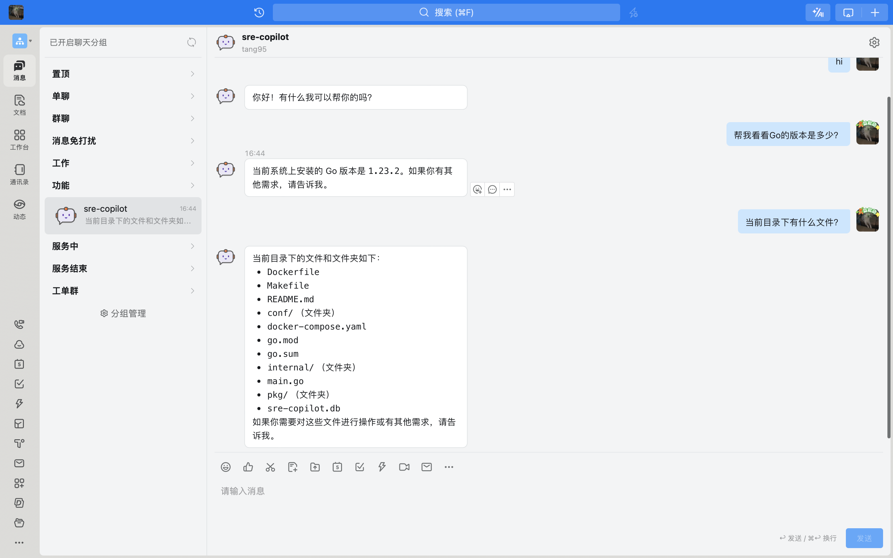

# sre-copilot

AI 驱动的 ChatOps 机器人，随时随地了解系统状态。




**集成开发中**

- 长期记忆
- GitLab
- Jenkins
- Kubernetes
- Grafana
- 阿里云

## 开发

前提条件

1. 需要 Go 环境，推荐 go 1.23+
2. 生成自己的配置文件，参考 [server.yaml](conf/server.yaml)

```shell
cd sre-copilot
go mod download
# 默认读取 $HOME/.sre-copilot/server.yaml，建议放在此处。
go run ./cmd server -c server.yaml
```
